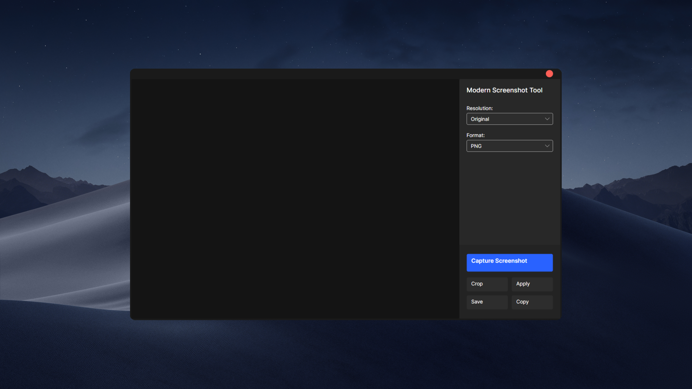

# Modern Screenshot Tool

A powerful and simple screenshot tool built with Avalonia UI, allowing you to capture, edit, and save screenshots with ease.

## Features

- Full-screen screenshot capture
- Crop functionality
- Multiple export formats (PNG, JPEG, BMP, GIF)
- Resolution adjustment options (4K, 2K, 1080p, 720p, Original)
- Copy to clipboard functionality
- Modern, intuitive user interface

## Technologies

- .NET 8.0
- Avalonia UI 11.2.1
- SkiaSharp for image processing

## Getting Started

1. Clone the repository
2. Open the solution in Visual Studio 2022 or JetBrains Rider
3. Build and run the application

## Requirements

- .NET 8.0 SDK or later
- Windows operating system

## Usage

1. Launch the application
2. Click the "Take Screenshot" button to take a screenshot
3. Use the crop functionality if needed
4. Choose your desired format and resolution
5. Save the image or copy to clipboard 